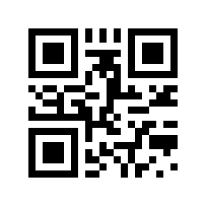
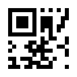

# qrtool

[![CI][ci-badge]][ci-url]
[![Version][version-badge]][version-url]
![License][license-badge]

**qrtool** is a command-line utility for encoding or decoding QR code.


## Installation

### From source

```sh
cargo install qrtool
```

### From binaries

The [release page][release-page-url] contains pre-built binaries for Linux,
macOS and Windows.

### How to build

Please see [BUILD.adoc](BUILD.adoc).

## Usage

### Basic usage

Encode a string in a QR code:

```sh
qrtool encode "QR code" > output.png
```

Generate this image:


Decode a QR code from this image:

```sh
qrtool decode output.png
```

Output:

```text
QR code
```

### SVG generation

```sh
qrtool encode -o output.svg -t svg "QR code"
```

Generate this image:



### Micro QR code generation

```sh
qrtool encode -v 3 --variant micro "QR code" > output.png
```

Generate this image:



### Colored output

```sh
qrtool encode --foreground brown "QR code" > output.png
```

Generate this image:


### Generate shell completion

`--generate-completion` option generates shell completions to stdout.

The following shells are supported:

- `bash`
- `elvish`
- `fish`
- `powershell`
- `zsh`

Example:

```sh
qrtool --generate-completion bash > qrtool.bash
```

## Integration with other programs

Both `encode` and `decode` can read from stdin and output to stdout.

The following example, the encoded result is saved as a JPEG XL image:

```sh
cat Cargo.toml | qrtool encode | magick png:- output.jxl
```

The following example, the decoded result is displayed by `bat`:

```sh
magick output.jxl png:- | qrtool decode | bat -l toml
```

## Command-line options

Please see the following:

- [`qrtool(1)`][qrtool-man-url]
- [`qrtool-encode(1)`][qrtool-encode-man-url]
- [`qrtool-decode(1)`][qrtool-decode-man-url]
- [`qrtool-help(1)`][qrtool-help-man-url]

## Changelog

Please see [CHANGELOG.adoc](CHANGELOG.adoc).

## Contributing

Please see [CONTRIBUTING.adoc](CONTRIBUTING.adoc).

## Acknowledgment

This program is inspired by [`qrencode`](https://fukuchi.org/works/qrencode/)
and [`zbarimg`](https://github.com/mchehab/zbar).

## License

Copyright &copy; 2022&ndash;2023 Shun Sakai (see [AUTHORS.adoc](AUTHORS.adoc))

1. This program is distributed under the terms of either the _Apache License
   2.0_ or the _MIT License_.
2. Some documentations are distributed under the terms of the _Creative Commons
   Attribution 4.0 International Public License_.

See [COPYRIGHT](COPYRIGHT), [LICENSE-APACHE](LICENSE-APACHE),
[LICENSE-MIT](LICENSE-MIT) and [LICENSE-CC-BY](LICENSE-CC-BY) for more details.

[ci-badge]: https://img.shields.io/github/actions/workflow/status/sorairolake/qrtool/CI.yaml?branch=develop&label=CI&logo=github&style=for-the-badge
[ci-url]: https://github.com/sorairolake/qrtool/actions?query=branch%3Adevelop+workflow%3ACI++
[version-badge]: https://img.shields.io/crates/v/qrtool?style=for-the-badge
[version-url]: https://crates.io/crates/qrtool
[license-badge]: https://img.shields.io/crates/l/qrtool?style=for-the-badge
[release-page-url]: https://github.com/sorairolake/qrtool/releases
[qrtool-man-url]: https://sorairolake.github.io/qrtool/man/qrtool.1.html
[qrtool-encode-man-url]: https://sorairolake.github.io/qrtool/man/qrtool-encode.1.html
[qrtool-decode-man-url]: https://sorairolake.github.io/qrtool/man/qrtool-decode.1.html
[qrtool-help-man-url]: https://sorairolake.github.io/qrtool/man/qrtool-help.1.html
